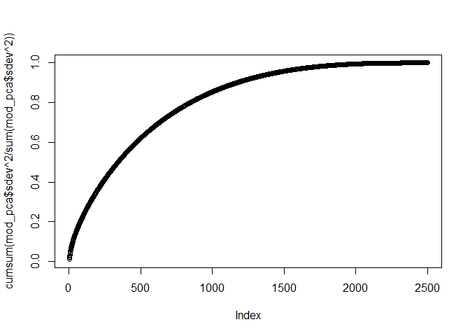
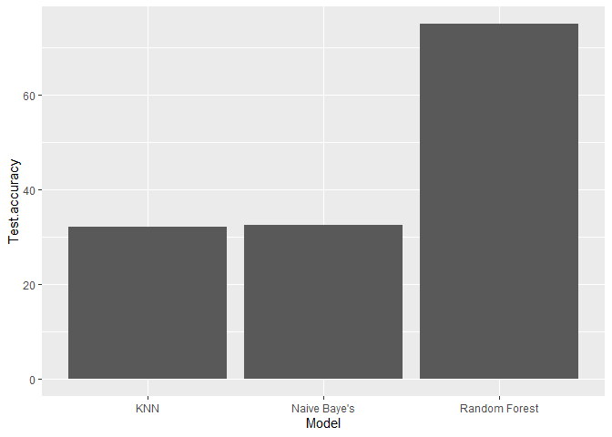

**Author attribution**
----------------------

### **Problem**

Predicting the authorship of the articles in the C50test directory using
a model trained using the c50train directory in the Reuters C50 Corpus.
Describe the pre-processing and analysis pipeline in detail

##### **0.Loading packages**

##### *Loading the required packages for text analysis*

##### **1. Reading files, Pre-processing and Tokenization**

##### *1.a.Reading files*

    #Reading all folders
    train=Sys.glob('C:/Users/Sahana/Documents/Predictive Models/ARM/ReutersC50/C50train/*')

    #Creating training dataset
    comb_art=NULL
    labels=NULL

    for (name in train)
    { 
      author=substring(name,first=50)#first= ; ensure less than string length
      article=Sys.glob(paste0(name,'/*.txt'))
      comb_art=append(comb_art,article)
      labels=append(labels,rep(author,length(article)))
    }

    #Cleaning the file names
    readerPlain <- function(fname)
      {
                    readPlain(elem=list(content=readLines(fname)), 
                                id=fname, language='en') 
      }

    comb = lapply(comb_art, readerPlain) 
    names(comb) = comb_art
    names(comb) = sub('.txt', '', names(comb))

    #Create a text mining corpus
    corp_tr=Corpus(VectorSource(comb))

##### *1.b. Pre-processing and tokenization:*

##### *- Convert alphabet to lower cases*

##### *- Removing numbers*

##### *- Removing punctuation*

##### *- Removing excess space*

##### *- Removing stop words*

    ## <<DocumentTermMatrix (documents: 2500, terms: 32571)>>
    ## Non-/sparse entries: 540361/80887139
    ## Sparsity           : 99%
    ## Maximal term length: 49
    ## Weighting          : term frequency (tf)

    ## <<DocumentTermMatrix (documents: 2500, terms: 3394)>>
    ## Non-/sparse entries: 382971/8102029
    ## Sparsity           : 95%
    ## Maximal term length: 49
    ## Weighting          : term frequency - inverse document frequency (normalized) (tf-idf)

##### **2. Repeating (1) for the test directories**

##### *2.a.Reading files*

    test=Sys.glob('C:/Users/Sahana/Documents/Predictive Models/ARM/ReutersC50/C50test/*')

    comb_art1=NULL
    labels1=NULL

    for (name in test)
    { 
      author1=substring(name,first=50)#first= ; ensure less than string length
      article1=Sys.glob(paste0(name,'/*.txt'))
      comb_art1=append(comb_art1,article1)
      labels1=append(labels1,rep(author1,length(article1)))
    }

    #Cleaning the file names!!
    comb1 = lapply(comb_art1, readerPlain) 
    names(comb1) = comb_art1
    names(comb1) = sub('.txt', '', names(comb1))

    #Create a text mining corpus
    corp_ts=Corpus(VectorSource(comb1))

##### *2.b.Pre-processing and tokenization*

##### *2.c. Ensuring identical test and train datasets*

    ## <<DocumentTermMatrix (documents: 2500, terms: 3394)>>
    ## Non-/sparse entries: 379314/8105686
    ## Sparsity           : 96%
    ## Maximal term length: 49
    ## Weighting          : term frequency - inverse document frequency (normalized) (tf-idf)

#### **3. Dimensionality reduction**

#### *Principal component analysis is used to (1) extract relevant features from the huge set of variables (2) eliminate the effect of multicollinearity while not losing out on relevant information from the correlated variables*

##### **3.a.Data Preparation for PCA**

#### *- To eliminate 0 entry columns*

    DTM_trr_1<-DTM_trr[,which(colSums(DTM_trr) != 0)] 
    DTM_tss_1<-DTM_tss[,which(colSums(DTM_tss) != 0)]

#### *- To use only the intersecting columns*

    #8312500 elements in both. 
    DTM_tss_1 = DTM_tss_1[,intersect(colnames(DTM_tss_1),colnames(DTM_trr_1))]
    DTM_trr_1 = DTM_trr_1[,intersect(colnames(DTM_tss_1),colnames(DTM_trr_1))]

#### **3.b.Extracting principal components**

    mod_pca = prcomp(DTM_trr_1,scale=TRUE)
    pred_pca=predict(mod_pca,newdata = DTM_tss_1)

#### **3.c.Choosing the right number of principal components**

#### *-Chosen till PC724 - almost 75% of variance explained*

    #Until PC724 - 74.5, almost 75% of variance explained. Hence stopping at 724 out of 2500 principal components
    plot(mod_pca,type='line') 

    var <- apply(mod_pca$x, 2, var)  
    prop <- var / sum(var)
    #cumsum(prop)
    plot(cumsum(mod_pca$sdev^2/sum(mod_pca$sdev^2)))

#### **Preparation of the dataset to be used for all the following classification purposes**

#### *-The dataset hopefully contains only the relevant and informational features for classifying the documents to the author rightly*

    tr_class = data.frame(mod_pca$x[,1:724])
    tr_class['author']=labels
    tr_load = mod_pca$rotation[,1:724]

    ts_class_pre <- scale(DTM_tss_1) %*% tr_load
    ts_class <- as.data.frame(ts_class_pre)
    ts_class['author']=labels1

#### **4. Classification techniques to attribute the documents to its authors**

#### **(A) Random Forest Technique**

#### *A.1.Technique*

#### *A.2. Computing accuracy*

#### *-1873 documents have their authors rightly classified; which provides an accuracy/classification rate of 74.9%*

    pre_rand<-predict(mod_rand,data=ts_class)

    tab_rand<-as.data.frame(table(pre_rand,as.factor(ts_class$author)))
    predicted<-pre_rand
    actual<-as.factor(ts_class$author)
    temp<-as.data.frame(cbind(actual,predicted))
    temp$flag<-ifelse(temp$actual==temp$predicted,1,0)
    sum(temp$flag)

    ## [1] 1911

    sum(temp$flag)*100/nrow(temp)

    ## [1] 76.44

#### **(B) Naive Baye’s**

#### *B.1.Model training and prediction on test set*

    library('e1071')
    mod_naive=naiveBayes(as.factor(author)~.,data=tr_class)
    pred_naive=predict(mod_naive,ts_class)

    ## Warning in data.matrix(newdata): NAs introduced by coercion

#### *B.2.Classification accuracy obtained*

#### *-810 documents have their authors rightly classified; which provides an accuracy/classification rate of 32.4%*

    library(caret)

    predicted_nb=pred_naive
    actual_nb=as.factor(ts_class$author)

    temp_nb<-as.data.frame(cbind(actual_nb,predicted_nb))
    temp_nb$flag<-ifelse(temp_nb$actual_nb==temp_nb$predicted_nb,1,0)
    sum(temp_nb$flag)

    ## [1] 812

    sum(temp_nb$flag)*100/nrow(temp_nb)

    ## [1] 32.48

    #32.4%

#### \*B.3.Comparing train and test accuracy\*\*

#### \*\*(C) K Nearest Neighbors

#### *C.1.Preparation of dataset*

    train.X = subset(tr_class, select = -c(author))
    test.X = subset(ts_class,select=-c(author))
    train.author=as.factor(tr_class$author)
    test.author=as.factor(ts_class$author)

#### *C.2.KNN method*

#### *-32.08% is the classification/accuracy rate obtained from KNN method, with a k-choice of 1. i.e., 802 documents rightly classified*

    library(class)
    set.seed(1)
    knn_pred=knn(train.X,test.X,train.author,k=1)

    temp_knn=as.data.frame(cbind(knn_pred,test.author))
    temp_knn_flag<-ifelse(as.integer(knn_pred)==as.integer(test.author),1,0)
    sum(temp_knn_flag)

    ## [1] 838

    sum(temp_knn_flag)*100/nrow(temp_knn) #802

    ## [1] 33.52

    #32.08% accuracy

#### *-4 different classification techniques were used to predict the author for the documents. The comparison of their results are as follows:*

#### *-Random forest provides the best accuracy out of the three methods, with a 74%. The other two methods provide drastically lower accuracies around 32%*

#### *-Multinomial logistic regression and other tree based methods can also be used for the attribution. But we have chosen 3 for this exercise*

    library(ggplot2)
    comp<-data.frame("Model"=c("Random Forest","Naive Baye's","KNN"), "Test.accuracy"=c(74.9,32.4,32.08))
    comp

    ##           Model Test.accuracy
    ## 1 Random Forest         74.90
    ## 2  Naive Baye's         32.40
    ## 3           KNN         32.08

    ggplot(comp,aes(x=Model,y=Test.accuracy))+geom_col()

